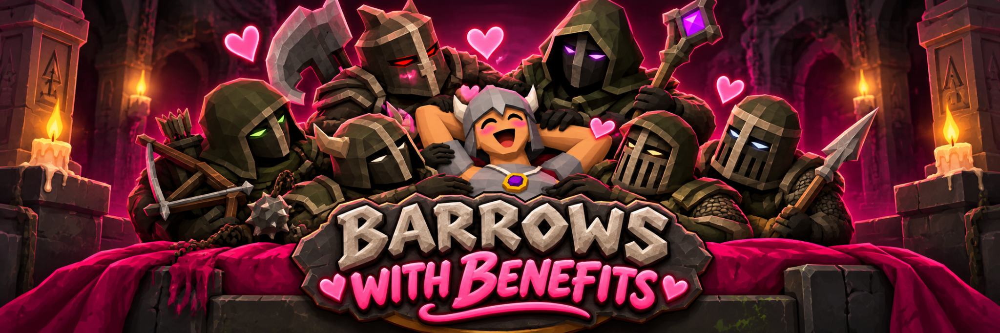
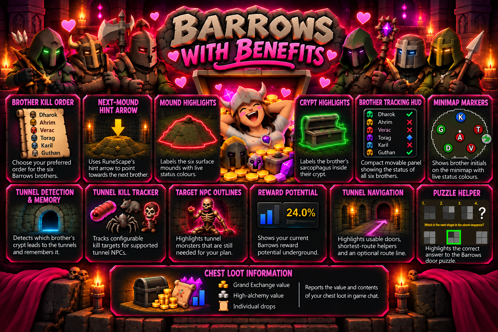

  

Barrows with Benefits is a RuneLite plugin that brings a collection of useful Barrows helpers together in one place.

The plugin is designed to help throughout an entire Barrows run: choosing and following a brother order, tracking kills, remembering the tunnel entrance, navigating the tunnel maze, completing a configurable tunnel kill plan, solving the door puzzle, and reviewing the value of your chest loot.

Most features can be configured individually through RuneLite, so you can use the helpers you want and disable the ones you don't.

## At a Glance

- **Brother Kill Order** — Choose your preferred order for the six Barrows brothers.
- **Next-Mound Hint Arrow** — Uses RuneScape's hint arrow to point towards the next brother in your configured order.
- **Mound Highlights** — Labels the six surface mounds and colours them according to their current status.
- **Crypt Highlights** — Labels the brother's sarcophagus while inside their crypt, with live kill/tunnel status colours.
- **Brother Tracking HUD** — Provides a compact RuneLite-style movable panel showing the status of all six brothers.
- **Minimap Markers** — Shows compact brother initials at the six Barrows mounds using the same live status information.
- **Tunnel Detection & Memory** — Detects which brother's crypt leads into the tunnels and remembers it for the run.
- **Tunnel Kill Tracker** — Tracks configurable kill targets for supported Barrows tunnel NPCs.
- **Target NPC Outlines** — Highlights tunnel monsters that are still needed for your configured kill plan.
- **Reward Potential** — Shows your current Barrows reward potential while underground.
- **Shortest-Route Door Helper** — Can highlight only the tunnel doors belonging to a shortest route towards the chest.
- **Shortest-Route Line** — Optionally draws the calculated route through the tunnel maze.
- **Chest Direction Indicator** — Can show an arrow when the remaining route continues beyond the visible portion of the path.
- **Tunnel Door Highlights** — Can highlight usable Barrows doors throughout the maze.
- **Puzzle Helper** — Highlights the correct answer to the Barrows door puzzle.
- **Chest Loot Information** — Can report Grand Exchange value, high-alchemy value, and individual chest drops in game chat.

  

---

## Brother Order

You can configure the order in which you prefer to kill:

- Dharok
- Ahrim
- Verac
- Torag
- Karil
- Guthan

The plugin keeps track of your progress and can use RuneScape's flashing hint arrow to point towards the mound for the next brother in your order.

Once the tunnel brother is known, that brother is automatically moved to the end of the effective order. This means the route can adapt during the run without requiring you to manually rearrange your configured order.

---

## The Six Brothers

Barrows with Benefits tracks Dharok, Ahrim, Verac, Torag, Karil and Guthan throughout the run.

### Surface Mounds

Each brother's complete diggable mound area can be highlighted and labelled.

Instead of drawing a grid around every individual tile, the plugin combines the diggable tiles into a single subtle mound area, keeping the overlay cleaner while still showing where the mound can be entered.

By default, the status colours represent:

- **Red** — the brother has not yet been defeated.
- **Green** — the brother has been defeated.
- **Blue** — this brother's crypt contains the tunnel entrance.

The colours themselves can be customised.

If a defeated brother is also the tunnel brother, the tunnel status takes priority so the entrance remains easy to identify.

### Crypts

Inside a brother's crypt, the plugin can highlight and label the actual sarcophagus rather than covering the surrounding floor with tiles.

The sarcophagus uses the same live brother/tunnel status information as the surface overlays.

An optional staircase highlight is also available for the current brother room.

### Minimap Markers

Compact brother initials are placed over the six mound locations on the minimap:

**D** Dharok · **A** Ahrim · **V** Verac · **T** Torag · **K** Karil · **G** Guthan

These markers use the same kill and tunnel state as the rest of the plugin, so the surface, minimap and HUD information remain consistent.

---

## Brother Tracking HUD

Barrows with Benefits provides a compact movable Barrows panel styled similarly to RuneLite's normal overlays.

Each brother is displayed with their current status:

- **✗** — not yet defeated
- **✓** — defeated
- **◆** — tunnel brother

The panel follows your effective brother order and can also display your tunnel kill plan and reward potential once you enter the maze.

The overlay can be moved using RuneLite's normal overlay movement controls.

---

## Finding and Remembering the Tunnel

When you search a Barrows sarcophagus, the plugin remembers which brother was searched while it waits to determine the result.

If the matching brother appears, the search is treated as the normal brother encounter.

If the hidden-tunnel interaction appears instead, the plugin records that brother as the tunnel brother.

Additional fallback handling is used so tunnel detection does not rely on a single chat message.

Once confirmed, the tunnel brother is reflected across the plugin's surface markers, minimap marker, brother order and HUD.

---

## Tunnel Kill Plan

Inside the tunnel maze, Barrows with Benefits can track configurable targets for:

- Bloodworms
- Crypt rats
- Giant crypt rats
- Crypt spiders
- Giant crypt spiders
- Skeletons

Each target can be configured separately, including setting a target to zero if you do not want that NPC included in your plan.

The current counts are displayed directly beneath the brother list in the plugin's Barrows panel.

Completed targets are visually marked so you can quickly see what is still required.

### Target NPC Outlines

The kill plan is also connected to optional NPC highlighting.

Tunnel monsters that are still required for your configured targets can be outlined using RuneLite's model-outline renderer.

Once a target has been completed, that NPC type no longer needs to be highlighted for the kill plan.

Outline colour and width can be customised.

---

## Reward Potential

Your current Barrows reward potential can be displayed directly in the Barrows tracking panel while inside the tunnel maze.

This makes it easier to see your current potential alongside your configured kill targets without maintaining a separate counter.

---

## Tunnel Navigation

Barrows with Benefits includes several optional tools for navigating the tunnel maze.

### Door Highlights

Usable Barrows tunnel doors can be outlined to make exits easier to identify.

The door highlight colour and outline width can be customised.

### Shortest-Route Doors

Instead of highlighting every usable door, the plugin can restrict door highlights to doors belonging to a calculated shortest route towards the centre chest room.

### Shortest-Route Line

An optional route line can be drawn through the tunnel maze.

The route is calculated from your current position using RuneLite's live movement/collision information together with currently usable Barrows doors.

Because the route begins at your current tile, it updates as you move through the maze rather than displaying a permanently fixed path.

The route line's colour and width can be configured.

### Chest Direction Indicator

If part of the calculated route continues beyond the portion that can currently be displayed, an optional direction indicator can be shown at the end of the visible route.

The plugin can also emphasise the next relevant route door to make the immediate next step easier to identify.

All of these features are visual navigation helpers only. The plugin does not move your character or open doors automatically.

---

## Puzzle Helper

When a Barrows puzzle door appears, Barrows with Benefits can identify and visually highlight the correct answer.

The puzzle highlight colour can be customised.

This remains a visual helper only — the plugin does not click or select the answer for you.

---

## Chest Loot

Barrows with Benefits can report information about the loot received from the Barrows chest.

Available messages include:

- **Grand Exchange value** — approximate total GE value of the chest loot.
- **High Alchemy value** — total high-alchemy value of the received loot.
- **Individual drops** — item names and quantities received from the chest.

These can be enabled or disabled separately.

The plugin determines the items received from the chest rather than simply calculating the value of everything already present in your inventory.

For example, if you already have **1,000 Death runes** and receive another **200**, the chest calculation is intended to use the newly received amount rather than treating your existing stack as part of the reward.

---

## Configuration

Barrows with Benefits is split into several configurable areas:

- **Brother tiles** — surface/crypt markers, kill-status colours and staircase highlighting.
- **Brother kill order** — preferred brother order and next-mound hint arrow.
- **Tunnel memory & HUD** — tunnel markers and related display options.
- **Tunnel kill tracker** — NPC targets, target highlighting and reward potential.
- **Tunnel doors & puzzle** — door highlighting, shortest-route helpers and puzzle highlighting.
- **Chest loot messages** — GE value, high-alchemy value and individual drop messages.

Colours, outline widths and several display options can also be customised.

The aim is to keep the individual helpers optional rather than requiring one particular way of doing Barrows.

---

## Credits

Barrows with Benefits wouldn't have developed into what it is without the RuneLite community and the open-source Barrows plugins that came before it.

A big thank you to:

- **RuneLite & RuneLite Barrows Brothers**
- **Barrows Door Highlighter** by Jordan Hans
- **Barrows Sarcophagus Memory** by vahnx
- **Barrows Tunnels Kill Tracker** by vahnx

These projects have been useful references and sources of inspiration while learning how RuneLite plugins work and developing the different parts of Barrows with Benefits.

Where third-party source has been used or adapted, the original project's licence and copyright still apply.

More detailed attribution and licence information can be found in `THIRD_PARTY_NOTICES.txt`.

---

## Licence

Barrows with Benefits is open-source software released under the **BSD 2-Clause License**.

**Copyright © 2026 SquidMuncher420**

See [`LICENSE`](LICENSE) for the full licence.
